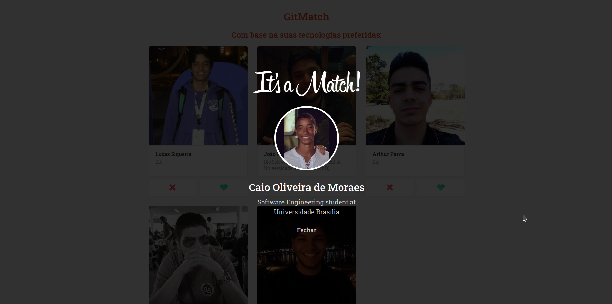
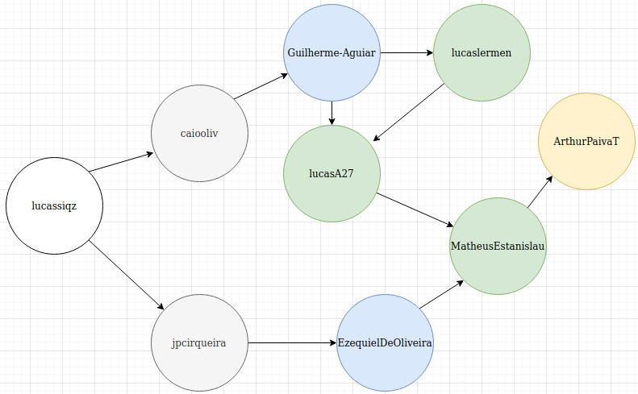

# GitMatch

**Número da Lista**: Final 
**Conteúdo da Disciplina**: Trabalho Final 
**Número da Dupla:** 13 

## Alunos
|Matrícula | Aluno |
| -- | -- |
| 16/0123119  |  Guilherme de Oliveira Aguiar |
| 15/0137567  |  Lucas Siqueira Rodrigues |

## Sobre 

O GitMatch é a aplicação que vai te ajudar a encontrar parceiro de programação. Nele você pode criar uma conta associando seu user do github e vai poder encontrar outros usuários para dar o match e começar a programar!
O gitMatch oferece duas seções para você achar o(a) colega de programação, a primeira é a seção baseada nas suas tecnologias preferidas, de acordo com as que você escolheu no cadastro. Para ordenar os seus possiveis desenvolvedores, usamos o algoritmo merge sort para contar as inversões a partir das suas preferências de tecnologias.

A segunda seção tem base nos likes que você já deu na plataforma, os candidatos são exibidos de acordo com uma busca em largura, sendo necessário fazer login para ver os recomendados, onde é possível fazer logout e logar com outros usuários pré-cadastrados e também dar like em outros usuários na pagina da home. O sistema vai não vai te recomendar pessoas que você já deu like, ele vai analisar as camadas intermediárias a partir do grafo que é criado tendo o usuário logado no momento como nó inicial. Sempre que uma nova avaliação é feita o BFS é chamado novamente e a lista de usuários recomendados é atualizada. 

O projeto não possui banco de dados, as alterações só são mantidas enquanto o pagina esta em execução, ao atualizar a pagina por exemplo os dados voltam para o estado inicial.

## Screenshots

### Página de registro

 

### Página de registro com seleção das tecnologias

 

### Página do login

### Página de home: Seção "Com base na suas tecnologias preferidas":

### Página de home: Seção "Com base nos seus likes: ":

### Página de match 

## Instalação 
**Linguagem**: 

- [Javascript](https://developer.mozilla.org/pt-BR/docs/Web/JavaScript)

**Tecnologias**: 

- [React](https://pt-br.reactjs.org/)
- [Styled-components](https://styled-components.com/)
- [react-toastify](https://www.npmjs.com/package/react-toastify)
- [Material UI](https://material-ui.com/pt/)
- [Axios](https://github.com/axios/axios)

O deploy da aplicação foi feito pelo netlify na url: https://gitmatch.netlify.app/

Caso queira executar o projeto em sua maquina, é necessário ter o node instalado, recomendamos a utilização do yarn como gerenciador de pacotes, porém também pode ser utilizado com o npm, e siga os seguintes passos:

Clone o repositório
> git clone https://github.com/projeto-de-algoritmos/Final_GitMatch.git

Acesse a pasta
> cd Final_GitMatch 

Instale as dependências
> yarn

Execute o projeto
> yarn start

## Uso 

Ao iniciar a aplicação, você pode escolher utilizar um dos usuários disponíveis, ou registrar um novo usuário. Você começa na página de login. Caso opte por registrar um novo usuário, você deve clicar no link "Criar Conta", abaixo do botão de entrar da página de login, lá você podera inserir um nome associado a um usuário do github e selecionar as tecnologias na ordem que você tem mais afinidade, a ordem que você seleciona cada uma das 5 tecnologias é importante, você deve selecionar aquelas que você tem mais afinidade primeiro e não deve deixar de clicar em nenhuma. Se a criação tiver dado certo, um popup verde vai aparecer comunicando o sucesso da operação.

Após a criação você pode logar e interagir, dando dislike e like as recomendações de usuários pra você, se você der like em um usuário que te deu like, vocês vão ter um match!

## Grafo dos usuários
- O Grafo abaixo é visto a partir do usuário lucassiqz:

#### Usuários disponíveis:
- lucaslermen
- Guilherme-Aguiar
- ArthurPaivaT
- lucassiqz
- MatheusEstanislau
- lucasA27
- caiooliv
- jpcirqueira
- EzequielDeOliveira

#### Tecnologias disponíveis para seleção:
- Javascript
- Python
- Java
- C++
- PHP

## Apresentação
A apresentação em video está disponível no link: 

## Referências
- Aulas do professor
- [Graph Traversal with BFS](https://dev.to/clintdev/graph-traversal-with-bfs-code-javascript-3nc6)
- [Counting Inversions](https://medium.com/@ssbothwell/counting-inversions-with-merge-sort-4d9910dc95f0)

